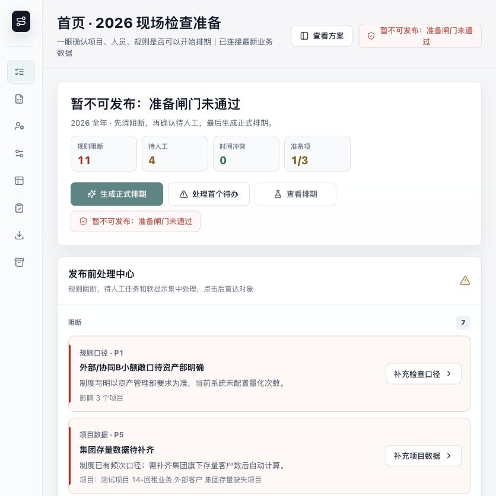
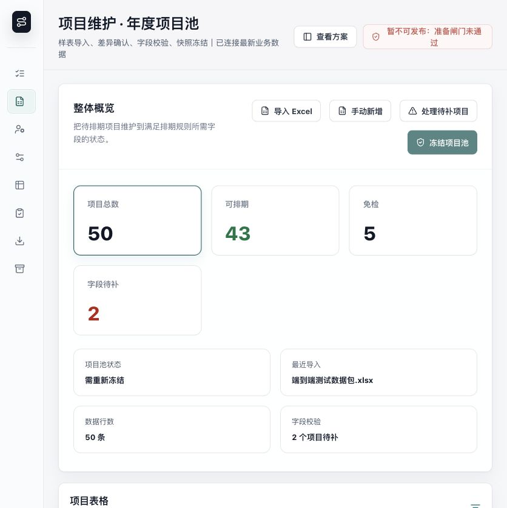
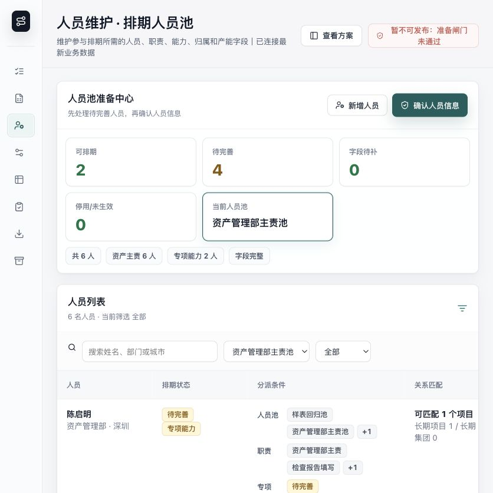
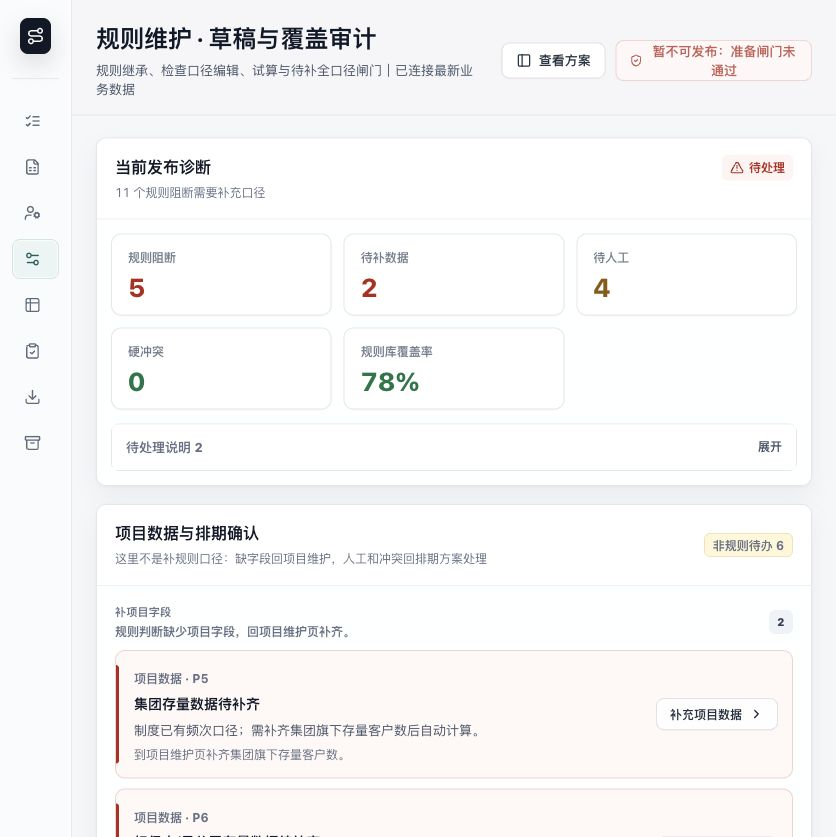
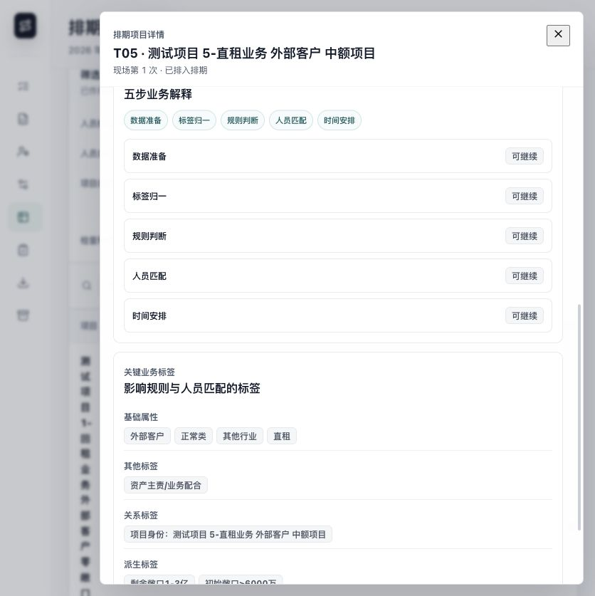
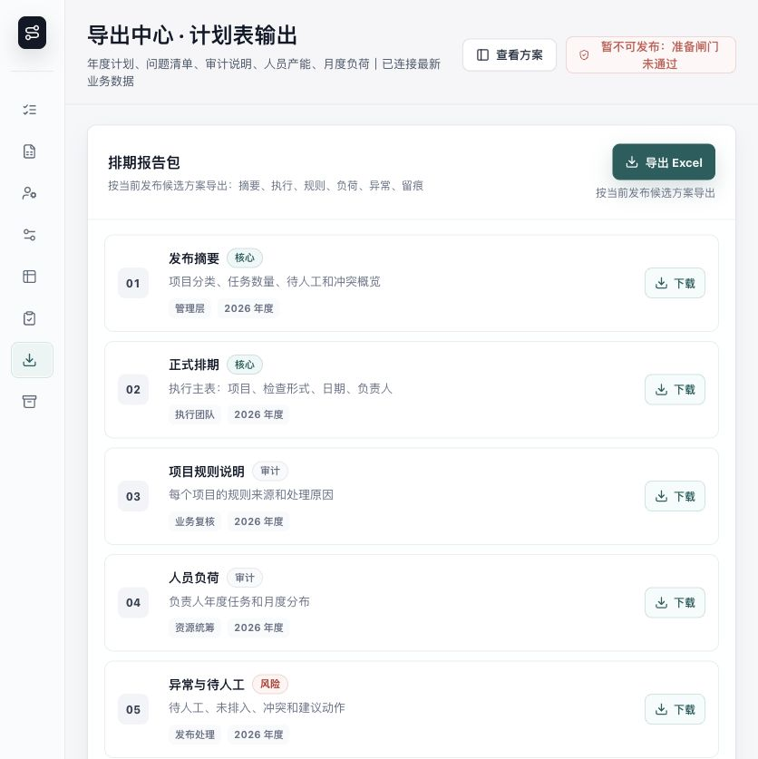

# 现场检查调度系统操作手册

适用对象：金融租赁公司检查排期负责人、项目维护人员、人员池管理员、规则维护人员、管理复核人员。

系统目标：把项目、人员、规则三类准备工作串成一条闭环，最终生成可解释、可追溯、可导出的年度现场检查排期。

线上地址：https://onsite-inspection-scheduler.vercel.app/

## 一、整体操作主线

业务用户按以下顺序操作：

1. 在首页查看年度准备状态，确认还有哪些事项未处理。
2. 在项目维护页导入或补充项目信息。
3. 在人员维护页确认人员池、专项能力、长期负责关系和容量。
4. 在规则维护页处理规则口径、项目数据缺口和人工确认事项。
5. 回到首页点击生成正式排期。
6. 在排期方案页查看每个项目的排期结果和五步依据。
7. 在导出中心下载排期报告。
8. 在归档页管理已经生成的正式排期。

## 二、首页：判断是否可以开始排期

进入系统后，首页会展示本年度现场检查准备状态。

重点看四类数字：

- 规则阻断：规则口径尚未确认，未处理前不能生成可发布方案。
- 待人工：需要业务人员确认安排或本年不安排。
- 时间冲突：已经排出的任务存在硬性冲突。
- 准备项：项目池、人员池、规则口径等准备门槛。

推荐操作：

1. 先点击规则阻断，进入规则维护页处理口径。
2. 再点击待人工，进入排期页处理具体任务。
3. 如果所有硬阻断清零，点击生成正式排期。

首页按钮含义：

- 生成正式排期：在准备门槛通过后生成年度正式排期草案。
- 处理首个待办：直接跳到当前最优先处理的问题。
- 查看排期：进入当前候选排期方案。

## 三、项目维护：导入和补充项目信息

项目维护页负责回答一个问题：项目字段是否足够支撑排期计算。

### 1. 导入项目信息

在项目维护页点击导入 Excel，把待排期项目导入系统。导入后先看整体概览：

- 项目总数：当前年度项目池内的项目数量。
- 可排期：字段完整、可进入规则判断的项目。
- 免检：根据制度规则不纳入本年检查的项目。
- 字段待补：项目字段缺失，需要回到项目维护补充。
- 待补规则：项目字段已具备，但规则口径尚未确认。

### 2. 补充项目字段

如果项目显示字段待补，点击该项目或待补字段标签，进入项目编辑区。

优先补充这些业务字段：

- 客户类型：外部客户、内部客户、协同 A、协同 B。
- 业务类型：回租、直租、保理等。
- 风险分类：正常、关注、不良等。
- 行业和医院类型：用于能源、医院等专项规则。
- 敞口金额：用于检查频次分档。
- 集团、担保人、母公司等关系信息：用于关系匹配和集团口径规则。
- 历史维护人或现场/非现场维护人：用于人员匹配兜底。

### 3. 理解项目状态

项目状态只看三类：

- 可排期：项目字段已满足排期计算。
- 字段待补：项目自身数据缺失，需要项目维护人员补齐。
- 免检/不纳入：制度规则判断本年不生成检查任务。

如果项目显示规则影响，例如“命中 P4，待规则确认”，说明项目字段本身没有问题，应跳到规则维护页处理规则口径。

## 四、人员维护：确认谁可以承接检查任务

人员维护页负责回答一个问题：当前人员池是否能够承接排期任务。

### 1. 维护人员基础信息

重点确认：

- 是否在当前排期池。
- 是否启用。
- 年度现场容量和非现场容量。
- 所属人员池，例如资产 7 人池。

### 2. 维护人员匹配标签

人员匹配会按业务优先级执行。建议按以下顺序维护：

1. 长期负责项目：项目明确由某人长期负责时优先命中。
2. 长期负责集团：大型集团或集团检查对象优先匹配长期负责集团的人。
3. 专项能力：例如直租专员、问题项目专员。
4. 历史维护人：没有更强关系时，参考过往维护关系。
5. 负荷均衡：前面都无法匹配时，系统按容量和负荷分配。

### 3. 处理人员待完善

如果人员显示专项能力待完善、长期归属待完善或字段待补，点击查看/编辑，在右侧抽屉中补齐。保存后系统会重新校验人员池，并影响后续排期负责人分配。

## 五、规则维护：补规则口径、补数据、确认人工事项

规则维护页负责回答一个问题：当前候选方案还有哪些制度规则问题需要处理。

### 1. 看当前发布诊断

顶部诊断数字分别表示：

- 规则阻断：当前项目真实命中的规则口径缺口。
- 待补数据：项目字段缺失，需回到项目维护补字段。
- 待人工：不硬阻断发布，但需要业务人员确认。
- 硬冲突：会阻断正式发布的时间或资源冲突。
- 规则库覆盖率：制度规则库整体维护完整度。

注意：规则库覆盖率和是否可发布不是同一个概念。是否可发布以当前候选方案的阻断和冲突为准。

### 2. 处理补充规则口径

对于 P1、P4 等规则口径缺口，建议按三步走：

1. 生成补充建议：系统基于当前命中的阻断生成可审核草稿。
2. 试算对排期的影响：确认补充口径后，先看会生成哪些任务、影响哪些项目。
3. 确认纳入正式排期规则：确认后刷新候选方案，首页、排期页和导出中心会同步变化。

按钮业务含义：

- 使用系统建议并试算：采用系统模板建议，并立即计算影响。
- 我要调整口径：业务人员手动修改频次或说明。
- 保存草稿：仅保存填写内容，不影响排期。
- 试算对排期的影响：只看影响，不正式纳入。
- 确认纳入正式排期规则：正式影响后续候选排期。

### 3. 处理项目数据缺口

如果规则页显示项目数据缺口，例如集团存量数量待补，应点击去项目维护。补齐项目字段后，系统会重新判断规则，不需要在规则页手工填写。

### 4. 处理待人工事项

内部客户、不强制检查等事项会进入待人工确认。点击事项后进入排期页右侧抽屉，可选择：

- 安排检查：补充负责人和开始日期。
- 本年不安排：填写确认原因，该任务从待人工队列移除。

## 六、生成正式排期

当项目、人员、规则准备完成，并且没有硬阻断时，回到首页点击生成正式排期。

生成过程分为三步：

1. 确认准备状态：检查项目池、人员池、规则口径是否通过。
2. 计算排期方案：按频次规则、人员匹配和时间约束生成任务。
3. 生成完成：展示项目数、任务数、待人工数和冲突数。

如果仍有待人工事项，系统可以生成正式草案，但会在排期页继续提醒处理。

## 七、排期方案：查看结果和五步依据

排期方案页负责回答一个问题：每个项目为什么这样排。

### 1. 使用筛选和搜索

排期页支持按以下维度筛选：

- 人员姓名：具体负责人或待人工。
- 人员类型：来自算法使用的人员标签，例如直租专员、问题项目专员。
- 项目类型：客户类型和业务类型，例如外部客户、内部客户、保理、直租。
- 检查形式：现场检查、非现场检查。
- 搜索：按项目编号或项目名称定位。

筛选后，下方待人工队列和项目矩阵会同步变化。

### 2. 打开项目详情

在项目规则覆盖矩阵中点击任一项目，右侧会打开排期项目详情。

详情优先展示：

- 排期结论：已排入、待人工确认、规则阻断、免检或人工确认不安排。
- 检查次数：现场次数、非现场次数。
- 负责人：当前任务负责人。
- 计划窗口：现场和非现场检查时间。
- 当前任务：第几次现场或非现场检查。

### 3. 查看五步业务依据

在项目详情中找到“为什么这样排 / 五步业务解释”。每一条排期都会按五步解释：

1. 数据准备：项目字段是否完整，是否具备计算条件。
2. 标签归一：系统把项目字段转换成客户类型、业务类型、敞口分档、关系标签等业务标签。
3. 规则判断：说明命中哪条制度规则，以及输出的现场/非现场频次。
4. 人员匹配：说明为什么分配给当前负责人，例如长期负责项目、长期负责集团、专项能力、历史维护人或负荷均衡。
5. 时间安排：说明为什么排在当前计划窗口，是否避开冲突和节假日。

如果项目是免检或规则阻断，五步依据会说明在哪一步被排除或阻断。

## 八、处理待人工排期

在排期页点击待人工队列或矩阵中的待确认项目，右侧抽屉会打开处理区。

处理方式：

- 选择安排检查：补齐负责人和开始日期后保存，任务进入排期。
- 选择本年不安排：填写确认原因后保存，任务不再进入待人工队列。
- 重新安排：对已经人工确认的任务恢复处理。

保存后会同步影响：

- 待人工数字。
- 项目矩阵状态。
- 审计留痕。
- 导出报告中的异常与待人工清单。

## 九、导出中心：下载排期报告

导出中心负责输出最终管理材料。

建议导出前确认：

- 项目总数、纳入检查、免检/不纳入、待人工是否符合预期。
- 正式排期列表是否已经生成。
- 异常与待人工是否已经处理或有说明。

导出报告通常包含：

- 发布摘要。
- 正式排期。
- 异常与待人工。
- 人员负荷。
- 审计留痕。
- 字段说明。

点击下载后，页面会显示生成状态、文件名和下载位置提示。

## 十、归档与后续编辑

生成正式排期后，可在归档页进行管理。

归档含义：把正式排期纳入历史管理，不代表立即锁定。

允许编辑的情况：

- 排期已经归档，但尚未超过该排期内最晚任务计划结束日。

不可编辑的情况：

- 当前日期已经晚于该排期内最晚任务计划结束日。

锁定后仍可查看、导出和追溯，但不能再调整负责人、日期或人工确认结果。

## 十一、业务验收清单

上线前建议按以下清单检查：

- 项目总数与导入 Excel 数量一致。
- 字段待补项目都能定位到具体字段。
- 人员池中每个人都有明确状态、容量和匹配标签。
- 规则阻断都能定位到具体规则和影响项目。
- 待人工事项都能安排检查或确认本年不安排。
- 每个已排入项目都能看到五步业务依据。
- 导出报告中的项目数、任务数、待人工数与页面一致。
- 归档后的正式排期仍可查看和导出。

## 十二、常见问题

### 为什么规则库覆盖率不是 100%，但仍能生成排期？

规则库覆盖率表示制度库整体维护程度。是否能生成当前方案，取决于当前项目池实际命中的规则是否已经处理。

### 为什么项目字段完整，但仍显示待规则确认？

这说明项目数据没有问题，但命中了尚未确认口径的制度规则，需要到规则维护页处理。

### 为什么待人工不一定阻断发布？

待人工是强提醒，提示业务人员需要确认安排方式；规则缺口和硬冲突才是硬阻断。

### 为什么有的项目没有现场任务？

可能因为制度规则判断为免检、只需非现场、两年一次未到期，或本年人工确认不安排。

### 如何证明负责人分配是合理的？

打开排期详情，在五步业务解释中的“人员匹配”查看分配依据。
